# Shiny Controls

A rich, ready-to-use UI controls library for both **.NET MAUI** and **Blazor**. One package per host covers TableView, Scheduler, FloatingPanel/OverlayHost, Fab/FabMenu, PillView, SecurityPin, TextToSpeechButton, ImageViewer, ImageEditor, ChatView, ColorPicker, FontPicker, AutoCompleteEntry, CountryPicker, and AddressEntry. Markdown and Mermaid Diagrams ship as separate add-on packages per host.

[](https://www.nuget.org/packages/Shiny.Maui.Controls)
[](https://www.nuget.org/packages/Shiny.Blazor.Controls)
[](https://www.nuget.org/packages/Shiny.Maui.Controls.Markdown)
[](https://www.nuget.org/packages/Shiny.Blazor.Controls.Markdown)
[](https://www.nuget.org/packages/Shiny.Maui.Controls.MermaidDiagrams)
[](https://www.nuget.org/packages/Shiny.Blazor.Controls.MermaidDiagrams)

## Getting Started

### .NET MAUI

```bash
dotnet add package Shiny.Maui.Controls
```

Register in your `MauiProgram.cs`:

```csharp
var builder = MauiApp.CreateBuilder();
builder
    .UseMauiApp<App>()
    .UseShinyControls();
```

Add the XAML namespace:

```xml
xmlns:shiny="http://shiny.net/maui/controls"
```

For Markdown controls (separate package):

```bash
dotnet add package Shiny.Maui.Controls.Markdown
```

```xml
xmlns:md="http://shiny.net/maui/markdown"
```

For Mermaid Diagrams (separate package):

```bash
dotnet add package Shiny.Maui.Controls.MermaidDiagrams
```

```xml
xmlns:diagram="http://shiny.net/maui/diagrams"
```

### Blazor

```bash
dotnet add package Shiny.Blazor.Controls
dotnet add package Shiny.Blazor.Controls.Markdown       # optional
dotnet add package Shiny.Blazor.Controls.MermaidDiagrams # optional
```

Add the `@using` directives — typically in `_Imports.razor`:

```razor
@using Shiny.Blazor.Controls
@using Shiny.Blazor.Controls.Cells
@using Shiny.Blazor.Controls.Sections
@using Shiny.Blazor.Controls.Scheduler
@using Shiny.Blazor.Controls.Markdown
@using Shiny.Blazor.Controls.MermaidDiagrams
```

No DI registration is required — drop the components into any `.razor` page.

#### MAUI → Blazor quick reference

| MAUI (XAML) | Blazor (Razor) |
|---|---|
| `<shiny:TableView>` with `<shiny:TableRoot>` | `<TableView>` (no `TableRoot` wrapper) |
| `<shiny:PillView>` | `<Pill>` |
| `<shiny:FloatingPanel>` in `<shiny:OverlayHost>` | `<SheetView>` with `<SheetContent>` child (Blazor uses CSS overlay) |
| `Value="{Binding Pin}"` (TwoWay) | `@bind-Value="pin"` |
| `IsOpen="{Binding IsOpen, Mode=TwoWay}"` | `@bind-IsOpen="isOpen"` |
| `Command="{Binding DoCommand}"` | `OnClick="DoAsync"` / `Clicked="DoAsync"` |
| `Color` type (e.g. `Colors.Blue`) | CSS color string (e.g. `"#2196F3"`) |
| `Fab.Icon="add.png"` (ImageSource) | `<Fab Icon="+">` (inline text/SVG string) |
| `ItemTemplate` as `DataTemplate` | `ItemTemplate` as `RenderFragment<object>` |

`ISchedulerEventProvider` is identical across both hosts.

## Controls

### Scheduler

Calendar and agenda views for displaying events and appointments, powered by `ISchedulerEventProvider`.

| Calendar | Agenda | Event List |
|:---:|:---:|:---:|
| 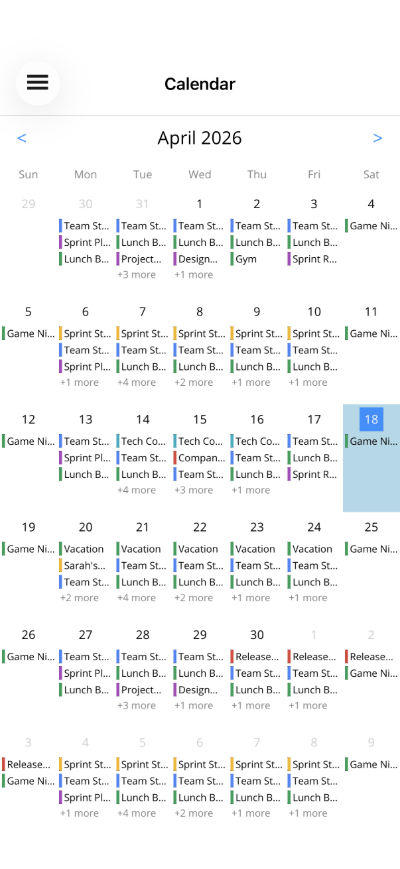 | 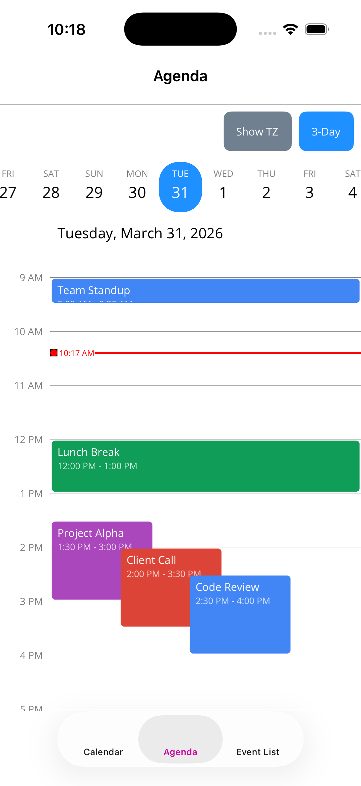 |  |

**SchedulerCalendarView** - Month calendar grid with event indicators, swipe navigation, and date selection.

```xml
<shiny:SchedulerCalendarView
    Provider="{Binding Provider}"
    SelectedDate="{Binding SelectedDate}"
    DisplayMonth="{Binding DisplayMonth}" />
```

**SchedulerAgendaView** - Day/multi-day timeline with time slots, overlapping event layout, current time marker, optional timezone columns, and switchable date picker modes (carousel, calendar sheet, or none).

```xml
<shiny:SchedulerAgendaView
    Provider="{Binding Provider}"
    SelectedDate="{Binding SelectedDate}"
    DaysToShow="{Binding DaysToShow}"
    DatePickerMode="Calendar"
    ShowAdditionalTimezones="{Binding ShowAdditionalTimezones}" />
```

**DatePickerMode** options: `Carousel` (default horizontal day picker), `Calendar` (collapsible month calendar with pull-to-expand), `None` (no picker).

**SchedulerCalendarListView** - Scrollable event list grouped by day with infinite scroll loading.

```xml
<shiny:SchedulerCalendarListView
    Provider="{Binding Provider}"
    SelectedDate="{Binding SelectedDate}" />
```

**ISchedulerEventProvider** - Implement this interface to supply event data:

```csharp
public class MyEventProvider : ISchedulerEventProvider
{
    public Task<IReadOnlyList<SchedulerEvent>> GetEvents(DateTimeOffset start, DateTimeOffset end) { ... }
    public void OnEventSelected(SchedulerEvent selectedEvent) { ... }
    public bool CanCalendarSelect(DateOnly selectedDate) => true;
    public void OnCalendarDateSelected(DateOnly selectedDate) { }
    public bool CanSelectAgendaTime(DateTimeOffset selectedTime) => true;
    public void OnAgendaTimeSelected(DateTimeOffset selectedTime) { }
}
```

### FloatingPanel + OverlayHost

A floating panel overlay system for MAUI. Panels slide in from the bottom or top of the screen with configurable snap positions (detents), optional header peek when closed, backdrop dimming, and haptic feedback. Multiple panels can coexist on the same page without blocking touches on content underneath.

**OverlayHost** is a transparent Grid layer that manages backdrop and touch passthrough. **FloatingPanel** is a panel that lives inside an OverlayHost. **ShinyContentPage** is a convenience ContentPage with a built-in OverlayHost.

| Closed | Open | Header (Closed) | Header (Open) | Top (Closed) | Top (Open) |
|:---:|:---:|:---:|:---:|:---:|:---:|
| 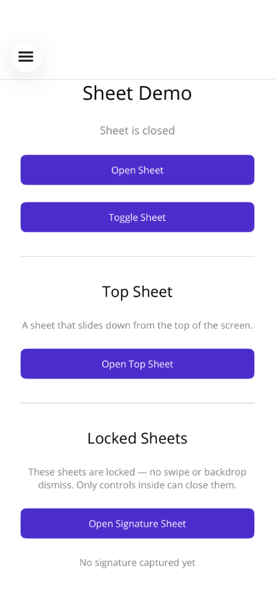 | 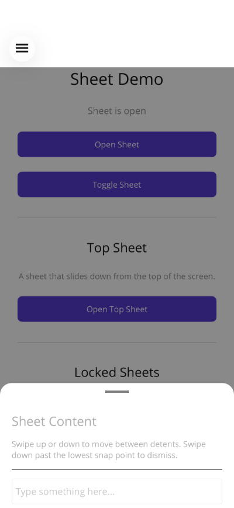 | 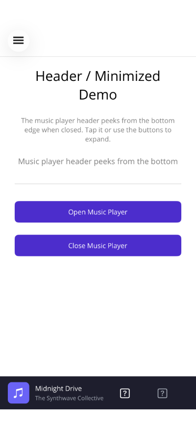 | 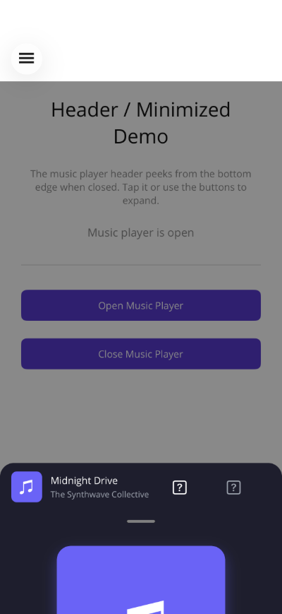 | 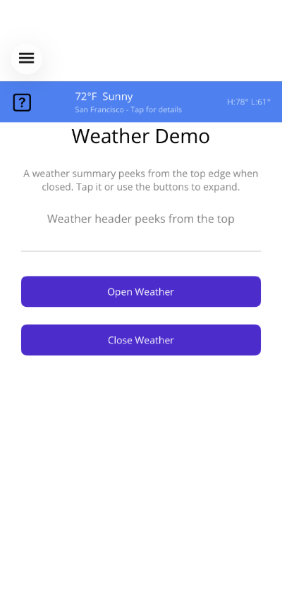 | 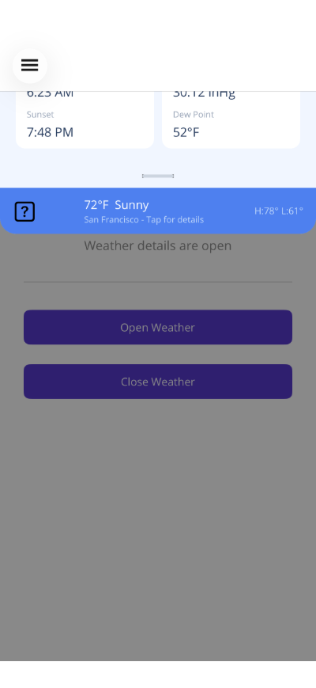 |

```xml
<!-- Using ShinyContentPage (recommended) -->
<shiny:ShinyContentPage xmlns:shiny="http://shiny.net/maui/controls">
    <shiny:ShinyContentPage.PageContent>
        <!-- Your page content here -->
    </shiny:ShinyContentPage.PageContent>
    <shiny:ShinyContentPage.Panels>
        <shiny:FloatingPanel
            IsOpen="{Binding IsSheetOpen}"
            Position="Bottom"
            HasBackdrop="True"
            CloseOnBackdropTap="True"
            PanelCornerRadius="16">
            <shiny:FloatingPanel.Detents>
                <shiny:DetentValue Value="Quarter" />
                <shiny:DetentValue Value="Half" />
                <shiny:DetentValue Value="Full" />
            </shiny:FloatingPanel.Detents>
            <!-- Your panel content here -->
        </shiny:FloatingPanel>
    </shiny:ShinyContentPage.Panels>
</shiny:ShinyContentPage>
```

**FloatingPanel Properties:**

| Property | Type | Description |
|---|---|---|
| IsOpen | bool | Show/hide the panel (TwoWay) |
| Position | FloatingPanelPosition | `Bottom`, `BottomTabs`, or `Top` — which edge the panel slides from. Use `BottomTabs` when inside a Shell TabBar to clip above the tab bar |
| Detents | ObservableCollection\<DetentValue\> | Snap positions (Quarter, Half, Full) |
| PanelContent | View | Content displayed in the panel (`[ContentProperty]`) |
| HeaderTemplate | View | Optional header view at the screen edge; shown as a peek bar when closed |
| ShowHeaderWhenClosed | bool | When true, the header peeks from the edge when the panel is closed |
| HasBackdrop | bool | Fade backdrop behind panel |
| CloseOnBackdropTap | bool | Close when backdrop tapped |
| PanelCornerRadius | double | Corner radius |
| HandleColor | Color | Drag handle color |
| ShowHandle | bool | Show/hide the drag handle bar |
| PanelBackgroundColor | Color | Panel background color |
| AnimationDuration | double | Animation speed (ms) |
| ExpandOnInputFocus | bool | Auto-expand when input focused |
| IsLocked | bool | Prevents drag dismiss; code-only control |
| FitContent | bool | Auto-computes detent from content size |
| UseHapticFeedback | bool | Haptic feedback on open, close, and detent snap (default: true) |

**OverlayHost Properties:**

| Property | Type | Description |
|---|---|---|
| BackdropColor | Color | Backdrop color (default: Black) |
| BackdropMaxOpacity | double | Maximum backdrop opacity (default: 0.5) |

**ShinyContentPage Properties:**

| Property | Type | Description |
|---|---|---|
| PageContent | View | Main page content |
| Panels | IList\<IView\> | Collection of FloatingPanels |
| BackdropColor | Color | Forwarded to internal OverlayHost |
| BackdropMaxOpacity | double | Forwarded to internal OverlayHost |

### ImageViewer

A full-screen image overlay with pinch-to-zoom, pan, double-tap zoom, and animated open/close transitions.

| Gallery | Viewer |
|:---:|:---:|
| 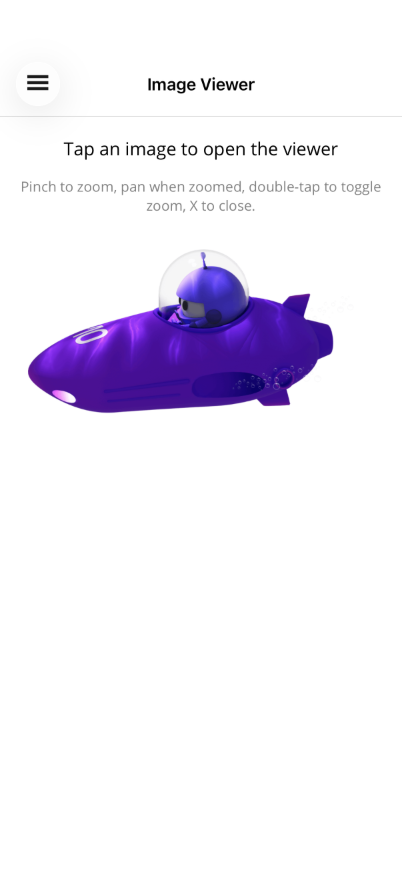 | 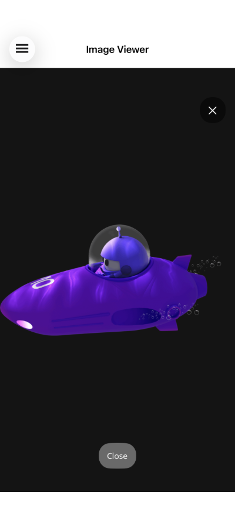 |

```xml
<Grid>
    <!-- Page content with tappable images -->
    <ScrollView>
        <VerticalStackLayout>
            <Image Source="photo.png">
                <Image.GestureRecognizers>
                    <TapGestureRecognizer Command="{Binding OpenViewerCommand}"
                                          CommandParameter="photo.png" />
                </Image.GestureRecognizers>
            </Image>
        </VerticalStackLayout>
    </ScrollView>

    <!-- ImageViewer overlays on top -->
    <shiny:ImageViewer Source="{Binding SelectedImage}"
                       IsOpen="{Binding IsViewerOpen}" />
</Grid>
```

| Property | Type | Description |
|---|---|---|
| Source | ImageSource? | The image to display |
| IsOpen | bool | Show/hide the viewer (TwoWay) |
| Aspect | Aspect | Image aspect ratio mode (default: AspectFit) |
| MaxZoom | double | Maximum zoom scale (default: 5.0) |
| CloseButtonTemplate | DataTemplate? | Custom close button (tapping closes viewer) |
| HeaderTemplate | DataTemplate? | Custom header overlay |
| FooterTemplate | DataTemplate? | Custom footer overlay |
| UseHapticFeedback | bool | Enable/disable haptic feedback on double-tap zoom (default: true) |

**Features:**
- Pinch-to-zoom with origin tracking
- Pan when zoomed (clamped to image bounds)
- Double-tap to zoom in (2.5x) / reset
- Animated fade open/close with backdrop
- Close button overlay

### ImageEditor

An inline image editor with cropping, rotation, freehand drawing, line and arrow drawing, text annotations with font family and font size selection, and zoom. Includes a built-in undo/redo stack, reset-to-original, and export to PNG/JPEG/WEBP at configurable resolutions. Every feature can be toggled on/off, and the default toolbar can be replaced with a custom template.

| Editor | Crop Mode |
|:---:|:---:|
| 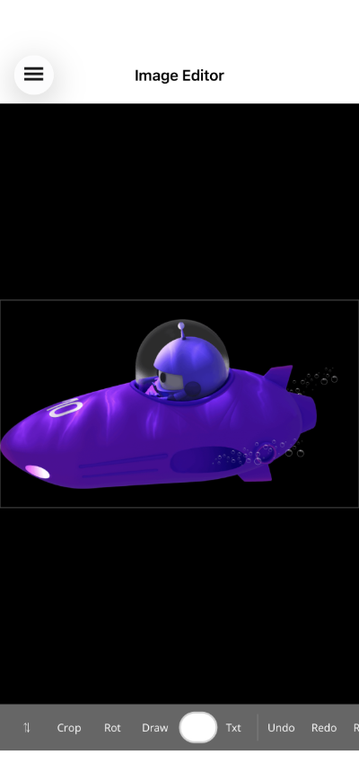 | 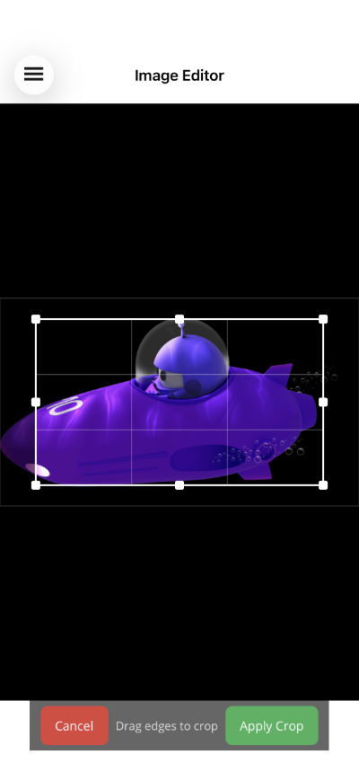 |

```xml
<shiny:ImageEditor Source="{Binding ImageSource}"
                   CurrentToolMode="{Binding ToolMode}"
                   AllowCrop="True"
                   AllowRotate="True"
                   AllowDraw="True"
                   AllowTextAnnotation="True"
                   DrawStrokeColor="Red"
                   DrawStrokeWidth="3" />
```

| Property | Type | Default | Description |
|---|---|---|---|
| Source | ImageSource? | null | Image to edit (supports file, stream, URI) |
| CurrentToolMode | ImageEditorToolMode | Move | Active tool (Move, Crop, Draw, Text, Line, Arrow) — TwoWay |
| AllowCrop | bool | true | Enable/disable crop tool |
| AllowRotate | bool | true | Enable/disable rotate action |
| AllowDraw | bool | true | Enable/disable freehand drawing |
| AllowTextAnnotation | bool | true | Enable/disable text annotation |
| AllowLine | bool | true | Enable/disable line drawing tool |
| AllowFontSelection | bool | false | Show font picker button in text mode |
| AllowFontSizeSelection | bool | false | Show font size picker button in text mode |
| AllowZoom | bool | true | Enable/disable pinch-to-zoom |
| CanUndo | bool | false | Whether undo is available (OneWayToSource) |
| CanRedo | bool | false | Whether redo is available (OneWayToSource) |
| DrawStrokeColor | Color | White | Drawing stroke color — TwoWay |
| DrawStrokeWidth | double | 3 | Drawing stroke width |
| TextFontSize | double | 16 | Text annotation font size |
| TextFontFamily | string? | null | Font family for text annotations (TwoWay) |
| AnnotationTextColor | Color | White | Text annotation color |
| AvailableFonts | IList\<string\>? | null | Font families shown in font picker |
| AvailableFontSizes | IList\<double\>? | null | Font sizes shown in font size picker |
| SaveCommand | ICommand? | null | Invoked with `EditedImage` parameter on save |
| SaveText | string | "Save" | Save button label |
| CropApplyText | string | "Apply Crop" | Crop apply button label |
| CropCancelText | string | "Cancel" | Crop cancel button label |
| ToolbarTemplate | DataTemplate? | null | Custom toolbar (replaces default) |
| ToolbarPosition | ToolbarPosition | Bottom | Toolbar placement (Top or Bottom) |
| UseHapticFeedback | bool | true | Haptic feedback on actions |

**Features:**
- Move mode with pinch-to-zoom and pan (origin-aware, double-tap to toggle)
- Crop with drag handles, rule-of-thirds grid, dimmed overlay, and dedicated Apply/Cancel toolbar
- 90° rotation (or arbitrary angles)
- Freehand drawing with configurable color and stroke width (constrained to image bounds)
- Line and arrow drawing between two points with configurable color and width
- Inline text annotations placed by tapping the image with optional font family and size selection
- Integrated color picker for draw color
- Font picker and font size picker integration (when `AllowFontSelection`/`AllowFontSizeSelection` enabled)
- Undo/redo for every edit action
- Reset to original image
- Save via `SaveCommand` with `EditedImage` — call `ToStreamAsync(format)` to get PNG, JPEG, or WEBP
- Image border showing the drawable surface area

**Commands:** `UndoCommand`, `RedoCommand`, `RotateCommand`, `ResetCommand`, `CropCommand`, `DrawCommand`, `TextCommand`, `LineCommand`, `SaveCommand`

**Methods:** `Undo()`, `Redo()`, `Rotate(float)`, `Reset()`, `ApplyCrop()`, `GetEditedImage()`

### ChatView

A modern chat UI control with message bubbles, typing indicators, load-more pagination, and a bottom input bar. Supports single-person and multi-person conversations with per-participant colors and avatars.

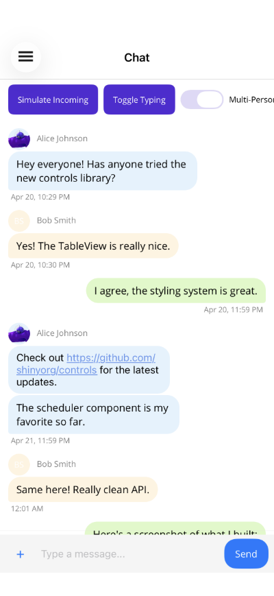

```xml
<shiny:ChatView Messages="{Binding Messages}"
                Participants="{Binding Participants}"
                IsMultiPerson="True"
                TypingParticipants="{Binding TypingParticipants}"
                SendCommand="{Binding SendCommand}"
                AttachImageCommand="{Binding AttachImageCommand}"
                LoadMoreCommand="{Binding LoadMoreCommand}"
                MyBubbleColor="#DCF8C6"
                OtherBubbleColor="White"
                PlaceholderText="Type a message..." />
```

| Property | Type | Default | Description |
|---|---|---|---|
| Messages | IList\<ChatMessage\> | null | Bindable message collection (supports INotifyCollectionChanged) |
| Participants | IList\<ChatParticipant\> | null | Participant info for avatar/color lookup |
| IsMultiPerson | bool | false | Show avatars and names for other participants |
| ShowAvatarsInSingleChat | bool | false | Force avatars even in single-person mode |
| MyBubbleColor | Color | #DCF8C6 | Local user bubble color |
| MyTextColor | Color | Black | Local user text color |
| OtherBubbleColor | Color | White | Default other-user bubble color |
| OtherTextColor | Color | Black | Other-user text color |
| PlaceholderText | string | "Type a message..." | Input placeholder |
| SendButtonText | string | "Send" | Send button label |
| IsInputBarVisible | bool | true | Show/hide the input bar |
| ShowTypingIndicator | bool | true | Enable typing notifications |
| TypingParticipants | IList\<ChatParticipant\> | null | Currently typing participants |
| ScrollToFirstUnread | bool | false | Scroll to first unread instead of end |
| FirstUnreadMessageId | string? | null | ID of the first unread message |
| UseHapticFeedback | bool | true | Haptic feedback on send |

**Commands:** `SendCommand` (ICommand, receives text string), `AttachImageCommand` (ICommand), `LoadMoreCommand` (ICommand)

**Methods:** `ScrollToEnd(bool animate)`, `ScrollToMessage(string messageId, bool animate)`

**Features:**
- Chat bubbles with left/right alignment and customizable colors per participant
- Visual grouping by sender and minute (tight spacing within group, wider between groups)
- Today timestamps show time only; previous days show full date
- Multi-person: avatar (initials or image) and name shown above first message in each group
- Single-person: avatars/names hidden by default
- Typing indicators ("{Name} is typing…", "{Name1}, {Name2} are typing", "Multiple users are typing")
- Virtualized via CollectionView with `RemainingItemsThreshold` for load-more
- Auto-link detection in text messages
- Image messages (text and image are mutually exclusive per message)
- Bottom input bar with Enter key and Send button; optional attach button
- Entire input bar can be hidden for read-only use

### ColorPicker

A full-featured color picker with spectrum, hue bar, opacity slider, hex input, and preview swatch. Available as both an inline `ColorPicker` control and a `ColorPickerButton` that opens as a popup dialog.

| Button | Picker Dialog |
|:---:|:---:|
| 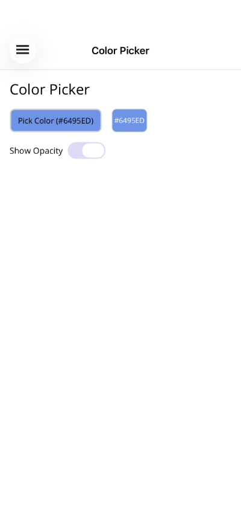 | 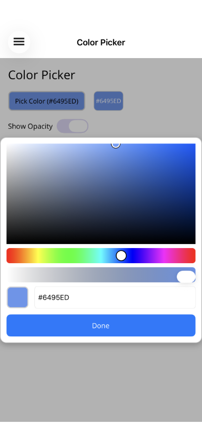 |

```xml
<shiny:ColorPickerButton SelectedColor="{Binding SelectedColor}"
                         Text="Pick Color"
                         ShowOpacity="True" />
```

| Property | Type | Default | Description |
|---|---|---|---|
| SelectedColor | Color | Red | Currently selected color — TwoWay |
| Text | string? | null | Button label text |
| ShowOpacity | bool | false | Show/hide opacity slider |
| CornerRadius | int | 8 | Button corner radius |
| ColorChangedCommand | ICommand? | null | Fires when color changes |

**Event:** `ColorChanged` (EventHandler\<Color\>)

### FontPicker

Font family and font size picker controls for MAUI. Includes inline list (`FontPicker`, `FontSizePicker`) and popup button (`FontPickerButton`, `FontSizePickerButton`) variants. Each font is rendered in its own typeface for instant visual preview.

```xml
<shiny:FontPickerButton AvailableFonts="{Binding Fonts}"
                        SelectedFont="{Binding SelectedFont, Mode=TwoWay}"
                        Placeholder="Font" />

<shiny:FontSizePickerButton AvailableFontSizes="{Binding Sizes}"
                            SelectedFontSize="{Binding SelectedSize, Mode=TwoWay}" />
```

**FontPicker / FontPickerButton:**

| Property | Type | Default | Description |
|---|---|---|---|
| AvailableFonts | IList\<string\>? | null | Font family names to display |
| SelectedFont | string? | null | Currently selected font (TwoWay) |
| PreviewText | string | "The quick brown fox" | Text rendered in each font row |
| PreviewFontSize | double | 18 | Size of preview text |
| Placeholder | string | "Font" | Button placeholder (button only) |
| CornerRadius | int | 8 | Button corner radius (button only) |
| FontChangedCommand | ICommand? | null | Command on selection (button only) |

**FontSizePicker / FontSizePickerButton:**

| Property | Type | Default | Description |
|---|---|---|---|
| AvailableFontSizes | IList\<double\>? | null | Font sizes to display |
| SelectedFontSize | double | 16 | Currently selected size (TwoWay) |
| PreviewText | string | "Aa" | Text rendered at each size |
| CornerRadius | int | 8 | Button corner radius (button only) |
| FontSizeChangedCommand | ICommand? | null | Command on selection (button only) |

These controls are also integrated into the **ImageEditor** toolbar when `AllowFontSelection` and `AllowFontSizeSelection` are enabled.

### AutoCompleteEntry

A text input with debounced search, dropdown suggestions, busy indicator, and custom item templates. Supports both local filtering and remote search via a command/callback. Available on both MAUI and Blazor with full styling control.

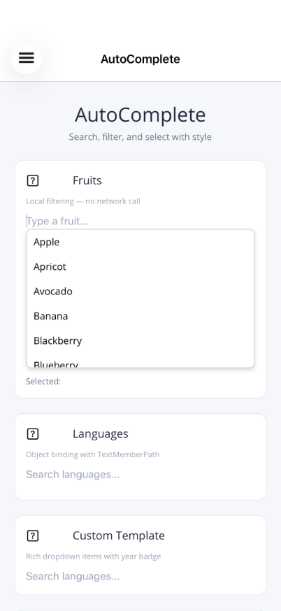

```xml
<shiny:AutoCompleteEntry
    Text="{Binding SearchText}"
    Placeholder="Search..."
    ItemsSource="{Binding Results}"
    SelectedItem="{Binding SelectedResult}"
    SearchCommand="{Binding SearchCommand}"
    TextMemberPath="Name"
    DebounceInterval="300"
    Threshold="2"
    MaxDropDownHeight="250"
    FontSize="16"
    TextColor="Black"
    DropDownBackgroundColor="White"
    DropDownBorderColor="LightGray"
    CornerRadius="8" />
```

| Property | Type | Default | Description |
|---|---|---|---|
| Text | string | "" | Current text value (TwoWay) |
| Placeholder | string? | null | Placeholder text |
| PlaceholderColor | Color/string | null | Placeholder text color |
| ItemsSource | IList | null | Suggestion items |
| SelectedItem | object? | null | Currently selected item (TwoWay) |
| SearchCommand | ICommand / EventCallback\<string\> | null | Remote search command |
| TextMemberPath | string? | null | Property name to display from items |
| ItemTemplate | DataTemplate / RenderFragment\<object\> | null | Custom dropdown item template |
| IsBusy | bool | false | Show/hide the loading spinner (TwoWay) |
| DebounceInterval | int | 300 | Debounce delay (ms) |
| Threshold | int | 1 | Minimum characters before searching |
| MaxDropDownHeight | double | 200 | Maximum dropdown height (px) |
| TextColor | Color/string | null | Input text color |
| FontSize | double | 14 | Input font size |
| FontFamily | string? | null | Input font family (MAUI only) |
| FontAttributes | FontAttributes | None | Bold/italic (MAUI only) |
| DropDownBackgroundColor | Color/string | White | Dropdown background |
| DropDownBorderColor | Color/string | LightGray | Dropdown border color |
| CornerRadius | double | 4 | Dropdown border radius (MAUI only) |
| SpinnerColor | Color/string | Grey | Loading spinner color |
| CssClass | string? | null | Root CSS class (Blazor only) |
| InputClass | string? | null | Input element CSS class (Blazor only) |
| DropDownClass | string? | null | Dropdown CSS class (Blazor only) |
| AdditionalAttributes | IDictionary | null | Unmatched HTML attributes (Blazor only) |

Events: `ItemSelected` fires when a suggestion is chosen.

**Blazor CSS Custom Properties** — Override these on a parent element or the component itself to theme without parameters:

| Variable | Default | Controls |
|---|---|---|
| `--shiny-ac-text` | inherit | Input text color |
| `--shiny-ac-ph` | #9CA3AF | Placeholder color |
| `--shiny-ac-dd-bg` | #fff | Dropdown background |
| `--shiny-ac-dd-border` | #D1D5DB | Dropdown border |
| `--shiny-ac-spinner` | #9CA3AF | Spinner color |
| `--shiny-ac-font-size` | inherit | Input font size |
| `--shiny-ac-dd-max-h` | 200px | Dropdown max height |

### CountryPicker

A country search control built on AutoCompleteEntry with flag emoji display, country name, and dial code. Searches all ISO 3166-1 countries.

| Empty | With Selection |
|:---:|:---:|
| 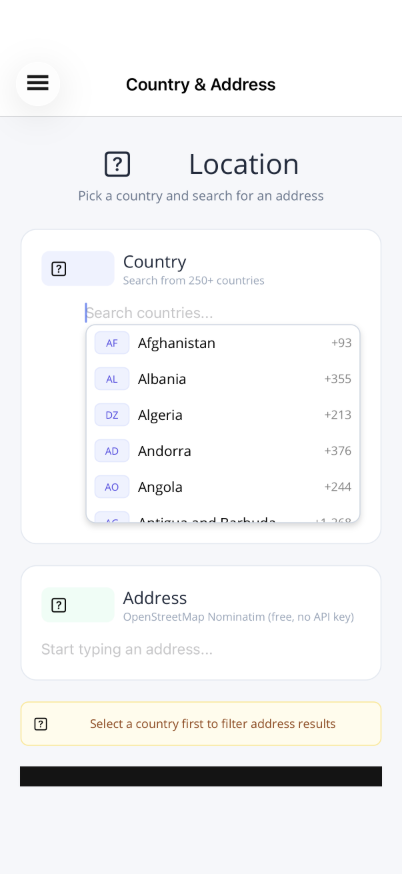 | 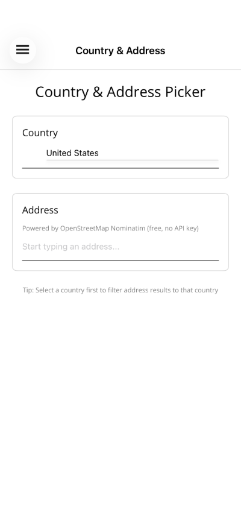 |

```xml
<shiny:CountryPicker SelectedCountry="{Binding Country}"
                     Placeholder="Select country..."
                     FontSize="16"
                     TextColor="Black" />
```

| Property | Type | Default | Description |
|---|---|---|---|
| SelectedCountry | Country | null | Selected country (TwoWay) |
| Placeholder | string | "Search countries..." | Placeholder text |
| MaxDropDownHeight | double | 200 | Max dropdown height |
| TextColor | Color/string | null | Text color |
| PlaceholderColor | Color/string | null | Placeholder color |
| DropDownBackgroundColor | Color/string | null | Dropdown background |
| DropDownBorderColor | Color/string | null | Dropdown border color |
| FontSize | double | 14 | Font size |
| FontFamily | string? | null | Font family (MAUI only) |
| CornerRadius | double | 4 | Dropdown corner radius (MAUI only) |
| InputClass | string? | null | Input CSS class (Blazor only) |
| DropDownClass | string? | null | Dropdown CSS class (Blazor only) |

Events: `CountrySelected` fires when a country is chosen.

The `Country` model provides: `Name`, `Iso2`, `Iso3`, `DialCode`, `FlagEmoji`.

### AddressEntry

An address search control built on AutoCompleteEntry that queries a geocoding provider (Nominatim/OpenStreetMap by default). Returns structured address data with coordinates.

```xml
<shiny:AddressEntry SelectedAddress="{Binding Address}"
                    Placeholder="Search address..."
                    CountryCodes="us,ca"
                    FontSize="16" />
```

| Property | Type | Default | Description |
|---|---|---|---|
| SelectedAddress | Address | null | Selected address (TwoWay) |
| SearchProvider | IAddressSearchProvider? | null | Custom search provider (defaults to Nominatim) |
| CountryCodes | string? | null | Comma-separated ISO country codes to filter results |
| Placeholder | string | "Search address..." | Placeholder text |
| MaxDropDownHeight | double | 250 | Max dropdown height |
| TextColor | Color/string | null | Text color |
| PlaceholderColor | Color/string | null | Placeholder color |
| DropDownBackgroundColor | Color/string | null | Dropdown background |
| DropDownBorderColor | Color/string | null | Dropdown border color |
| FontSize | double | 14 | Font size |
| FontFamily | string? | null | Font family (MAUI only) |
| CornerRadius | double | 4 | Dropdown corner radius (MAUI only) |
| InputClass | string? | null | Input CSS class (Blazor only) |
| DropDownClass | string? | null | Dropdown CSS class (Blazor only) |

Events: `AddressSelected` fires when an address is chosen.

The `Address` record provides: `DisplayName`, `HouseNumber`, `Street`, `City`, `State`, `PostalCode`, `Country`, `CountryCode`, `Latitude`, `Longitude`.

Implement `IAddressSearchProvider` for custom geocoding:

```csharp
public class MyGeoProvider : IAddressSearchProvider
{
    public Task<IList<Address>> SearchAsync(string query, string? countryCodes, CancellationToken ct)
    {
        // call your preferred geocoding API
    }
}
```

### PillView

Pill/chip/tag elements for displaying categories, filters, or status indicators with predefined or custom color schemes.

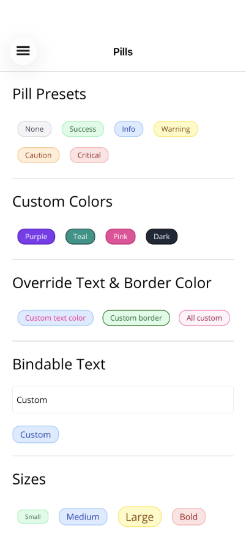

```xml
<shiny:PillView Text="Success" Type="Success" />
<shiny:PillView Text="Warning" Type="Warning" />
<shiny:PillView Text="Custom" PillColor="Purple" PillTextColor="White" />
```

| Pill Type | Description |
|---|---|
| None | Default/neutral |
| Success | Green |
| Info | Blue |
| Warning | Yellow |
| Caution | Orange |
| Critical | Red |

Each `PillType` maps to a well-known style key (e.g. `ShinyPillSuccessStyle`) that can be overridden in your app's `ResourceDictionary` to customize the preset themes.

### Fab & FabMenu

A Material Design-style floating action button, plus an expanding multi-action menu that animates up from the main FAB.

| Closed | Menu Open |
|:---:|:---:|
| 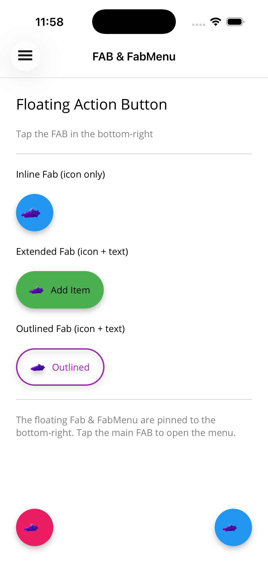 | 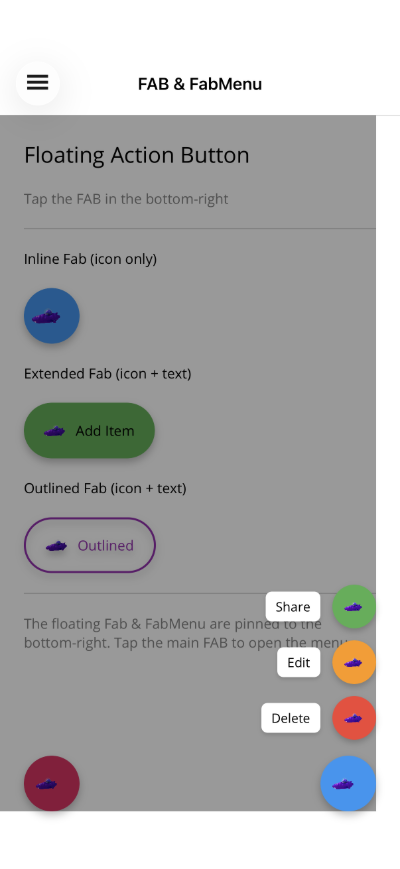 |

```xml
<!-- Single Fab -->
<shiny:Fab Icon="add.png"
           Text="Add Item"
           FabBackgroundColor="#4CAF50"
           TextColor="White"
           Command="{Binding AddCommand}"
           HorizontalOptions="End"
           VerticalOptions="End"
           Margin="24" />

<!-- FabMenu with child items -->
<shiny:FabMenu IsOpen="{Binding IsMenuOpen}"
               Icon="plus.png"
               FabBackgroundColor="#2196F3"
               HorizontalOptions="End"
               VerticalOptions="End"
               Margin="24">
    <shiny:FabMenuItem Icon="share.png"  Text="Share"  Command="{Binding ShareCommand}" />
    <shiny:FabMenuItem Icon="edit.png"   Text="Edit"   Command="{Binding EditCommand}" />
    <shiny:FabMenuItem Icon="delete.png" Text="Delete" Command="{Binding DeleteCommand}" />
</shiny:FabMenu>
```

**Fab** properties:

| Property | Type | Default | Description |
|---|---|---|---|
| Icon | ImageSource? | null | Button icon |
| Text | string? | null | Optional label; when null the Fab is a perfect circle |
| Command | ICommand? | null | Invoked when the Fab is tapped |
| CommandParameter | object? | null | Parameter passed to the Command |
| FabBackgroundColor | Color | #2196F3 | Fill color |
| BorderColor | Color? | null | Outline stroke color |
| BorderThickness | double | 0 | Outline stroke thickness |
| TextColor | Color | White | Label color |
| FontSize | double | 14 | Label font size |
| FontAttributes | FontAttributes | None | Label font attributes |
| Size | double | 56 | Height of the Fab (diameter when circular) |
| IconSize | double | 24 | Icon image size |
| HasShadow | bool | true | Show drop shadow |
| UseHapticFeedback | bool | true | Haptic feedback on tap |

Events: `Clicked`.

**FabMenu** properties (plus all main-Fab pass-throughs above):

| Property | Type | Default | Description |
|---|---|---|---|
| IsOpen | bool | false | Two-way bindable; opens/closes the menu with animation |
| Items | `IList<FabMenuItem>` | empty | Menu items (content property — place items directly inside the FabMenu) |
| HasBackdrop | bool | true | Show a dim backdrop while open |
| BackdropColor | Color | Black | Backdrop color |
| BackdropOpacity | double | 0.4 | Backdrop peak opacity |
| CloseOnBackdropTap | bool | true | Close when backdrop is tapped |
| CloseOnItemTap | bool | true | Close after any item is tapped |
| AnimationDuration | uint | 200 | Open/close animation duration (ms) |
| UseHapticFeedback | bool | true | Haptic feedback on toggle |

Events: `ItemTapped` — fires the `FabMenuItem` that was tapped.

Methods: `Open()`, `Close()`, `Toggle()`.

**FabMenuItem** properties:

| Property | Type | Default | Description |
|---|---|---|---|
| Icon | ImageSource? | null | Circular icon |
| Text | string? | null | Side label next to the icon |
| Command | ICommand? | null | Invoked when tapped |
| CommandParameter | object? | null | Parameter for the Command |
| FabBackgroundColor | Color | #2196F3 | Icon button fill |
| BorderColor | Color? | null | Icon button outline |
| BorderThickness | double | 0 | Icon button outline thickness |
| TextColor | Color | Black | Side-label text color |
| LabelBackgroundColor | Color | White | Side-label background |
| FontSize | double | 13 | Side-label font size |
| Size | double | 44 | Icon button diameter |
| IconSize | double | 20 | Icon image size |
| UseHapticFeedback | bool | true | Haptic feedback on tap |

**Placement tip**: `FabMenu` should live in a `Grid` that fills the page (the same placement pattern as `ImageViewer`) so the backdrop can cover the page content. Alternatively, use `ShinyContentPage` with `OverlayHost` for easier overlay management.

### SecurityPin

A PIN entry control with individually rendered cells that captures input through a hidden Entry. Digits remain visible by default and can optionally be masked with any character.

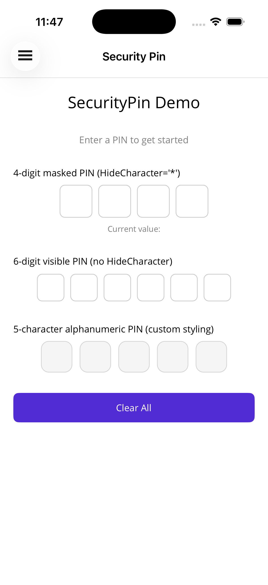

```xml
<shiny:SecurityPin Length="4"
                   HideCharacter="*"
                   Value="{Binding Pin}"
                   Keyboard="Numeric"
                   Completed="OnPinCompleted" />
```

| Property | Type | Default | Description |
|---|---|---|---|
| Length | int | 4 | Number of PIN cells |
| Value | string | "" | Current PIN value (TwoWay) |
| Keyboard | Keyboard | Numeric | Keyboard type for input |
| HideCharacter | string? | null | When set, masks entered characters; when null/empty, shows actual values |
| CellSize | double | 50 | Width/height of each cell |
| CellSpacing | double | 8 | Space between cells |
| CellCornerRadius | double | 8 | Border corner radius |
| CellBorderColor | Color? | null | Cell border color |
| CellFocusedBorderColor | Color? | null | Border color for the active cell |
| CellBackgroundColor | Color? | null | Cell fill color |
| CellTextColor | Color? | null | Entered character color |
| FontSize | double | 24 | Character font size |

| UseHapticFeedback | bool | Enable/disable haptic feedback on digit entry (click) and completion (long press) (default: true) |

Events: `Completed` fires with a `SecurityPinCompletedEventArgs` once the entered value reaches `Length`.

Methods: `Focus()`, `Unfocus()`, `Clear()`.

### TextToSpeechButton

A button that speaks bound text using the platform's text-to-speech engine. Fully customizable visually like a normal button, but instead of a Command binding, tapping plays the bound `SpeechText`. Tapping again while speaking cancels playback. Works on both MAUI (native TTS) and Blazor (Web Speech API).

```xml
<shiny:TextToSpeechButton Text="Listen"
                          SpeechText="{Binding ArticleText}"
                          ButtonBackgroundColor="#2196F3"
                          TextColor="White" />
```

```razor
<!-- Blazor -->
<TextToSpeechButton Text="Listen"
                    SpeechText="@articleText"
                    ButtonBackgroundColor="#2196F3" />
```

| Property | Type | Default | Description |
|---|---|---|---|
| SpeechText | string? | null | The text to speak when tapped |
| Text | string? | null | Button label |
| Icon | ImageSource? | null | Button icon |
| ButtonBackgroundColor | Color | #2196F3 | Fill color |
| TextColor | Color | White | Label color |
| FontSize | double | 14 | Label font size |
| FontAttributes | FontAttributes | None | Label font attributes |
| CornerRadius | double | 8 | Border corner radius |
| BorderColor | Color? | null | Outline stroke color |
| BorderThickness | double | 0 | Outline stroke thickness |
| IconSize | double | 24 | Icon dimensions |
| IsSpeaking | bool | false | Whether speech is in progress (OneWayToSource in MAUI, two-way bindable in Blazor) |
| Pitch | float | 1.0 | Speech pitch |
| Volume | float | 1.0 | Speech volume |
| Locale | Locale? | null | Speech locale (MAUI only) |
| UseHapticFeedback | bool | true | Haptic on tap (MAUI only) |
| HasShadow | bool | false | Drop shadow |

Blazor additionally exposes `Rate` (float, default 1.0) for speech rate, and `Locale` is a string (BCP-47 language tag).

Events: `Clicked` fires on every tap (before speak/cancel).

Methods: `Cancel()` programmatically stops speech (MAUI).

### TableView

A settings-style table view with 14+ built-in cell types, section grouping, drag-to-reorder, and dynamic data binding.

| Basic | Dynamic | Drag & Sort | Pickers | Styling |
|:---:|:---:|:---:|:---:|:---:|
| 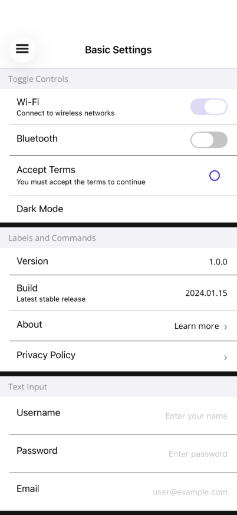 | 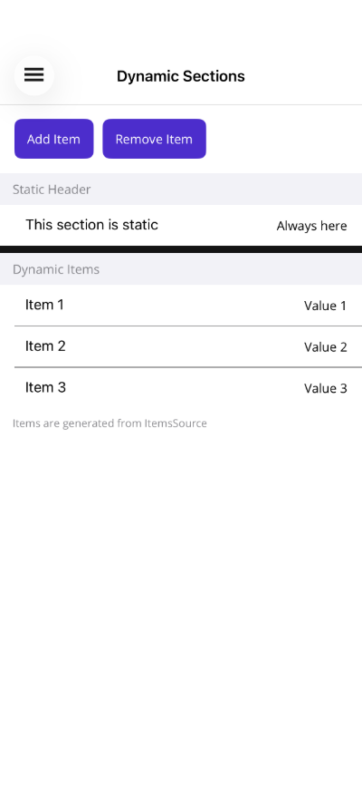 | 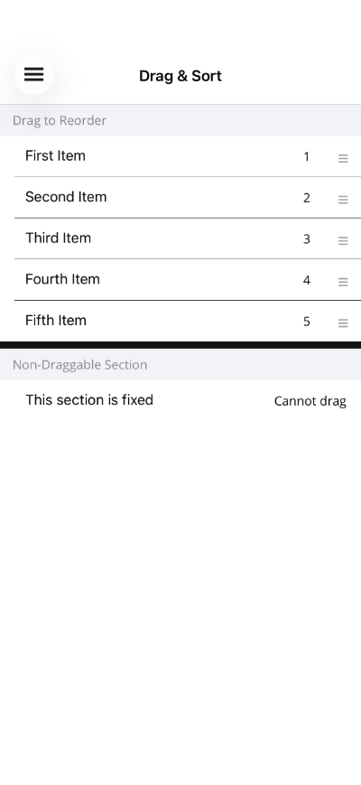 | 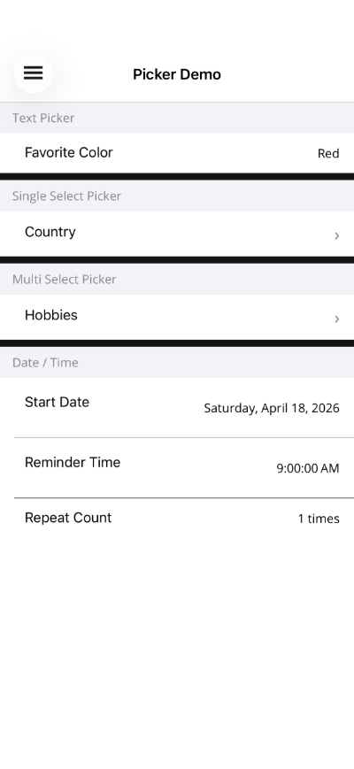 | 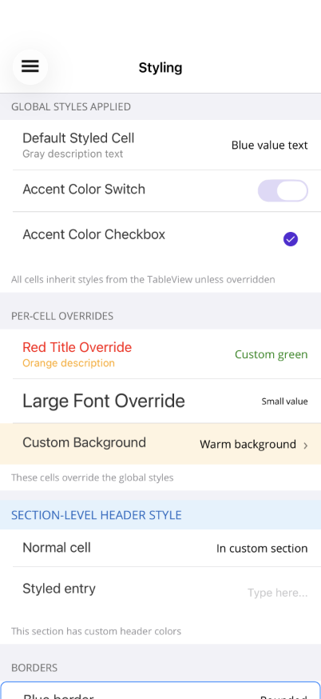 |

```xml
<shiny:TableView>
    <shiny:TableRoot>
        <shiny:TableSection Title="General">
            <shiny:SwitchCell Title="Wi-Fi" On="{Binding WifiEnabled}" />
            <shiny:EntryCell Title="Username" Text="{Binding Username}" />
            <shiny:PickerCell Title="Theme" ItemsSource="{Binding Themes}" SelectedItem="{Binding SelectedTheme}" />
        </shiny:TableSection>
    </shiny:TableRoot>
</shiny:TableView>
```

**Cell Types:**

| Cell | Description |
|---|---|
| SwitchCell | Toggle switch |
| EntryCell | Text input field |
| CheckboxCell | Checkbox with accent color |
| RadioCell | Radio button with section-level grouping |
| CommandCell | Tappable row with optional arrow indicator |
| ButtonCell | Command-bound button |
| LabelCell | Read-only text display |
| PickerCell | Single or multi-select picker |
| TextPickerCell | String list picker |
| DatePickerCell | Date selection with min/max bounds |
| TimePickerCell | Time selection |
| DurationPickerCell | TimeSpan picker with min/max |
| NumberPickerCell | Integer picker with min/max/unit |
| SimpleCheckCell | Checkmark indicator |
| CustomCell | Custom view content with drag-reorder support |

**Dynamic Sections** - Bind to a collection to generate sections from data:

```xml
<shiny:TableView ItemsSource="{Binding Items}" ItemTemplate="{StaticResource SectionTemplate}" />
```

### Markdown Controls

> Separate NuGet packages: `Shiny.Maui.Controls.Markdown` / `Shiny.Blazor.Controls.Markdown`

Render and edit markdown content using native MAUI controls — no WebView required on MAUI. Auto-resolves Light/Dark theming. Available for both MAUI and Blazor.

| Viewer | Editor |
|:---:|:---:|
| 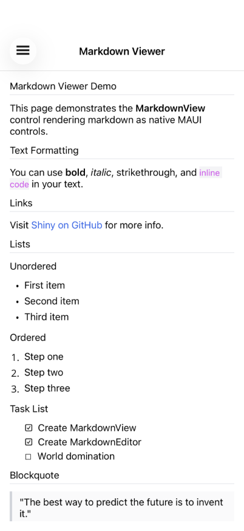 | 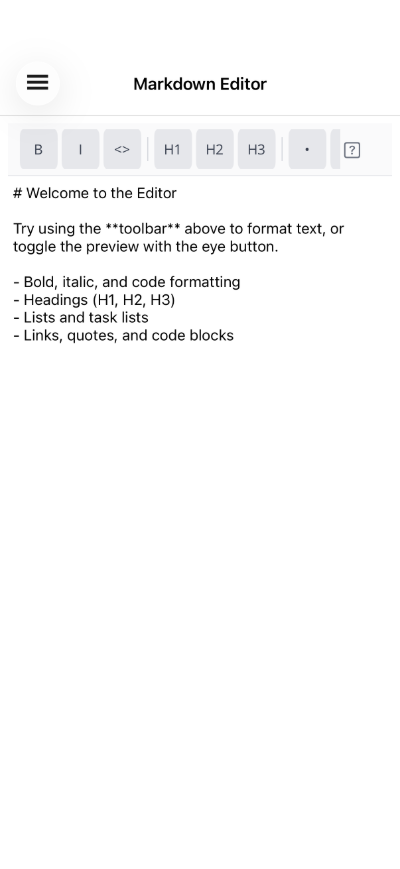 |

**MarkdownView** — Read-only markdown renderer:

```xml
<md:MarkdownView Markdown="{Binding DocumentContent}" Padding="16" />
```

| Property | Type | Description |
|---|---|---|
| Markdown | string | Markdown content to render |
| Theme | MarkdownTheme? | Rendering theme (auto Light/Dark if null) |
| IsScrollEnabled | bool | Enable/disable scrolling (default: true) |

Events: `LinkTapped` — fired when a link is tapped; set `Handled = true` to prevent default browser launch.

**MarkdownEditor** — Editor with formatting toolbar and live preview:

```xml
<md:MarkdownEditor Markdown="{Binding NoteContent, Mode=TwoWay}"
                   Placeholder="Start writing..."
                   Padding="8" />
```

| Property | Type | Description |
|---|---|---|
| Markdown | string | Markdown content (TwoWay) |
| Theme | MarkdownTheme? | Preview theme (auto Light/Dark if null) |
| Placeholder | string | Placeholder text |
| ToolbarItems | IReadOnlyList\<MarkdownToolbarItem\>? | Toolbar buttons (default set provided) |
| IsPreviewVisible | bool | Toggle preview pane (TwoWay) |
| ToolbarBackgroundColor | Color? | Toolbar background |
| EditorBackgroundColor | Color? | Editor background |

**Features:**
- Formatting toolbar: bold, italic, headings, lists, code, links, blockquotes
- Live preview toggle
- Auto-growing editor
- Full Markdig support: tables, task lists, strikethrough, fenced code blocks
- Customizable themes with colors, font sizes, and spacing
- Custom toolbar item support

### MermaidDiagramControl

> Separate NuGet packages: `Shiny.Maui.Controls.MermaidDiagrams` / `Shiny.Blazor.Controls.MermaidDiagrams`

Native Mermaid flowchart renderer — no WebView, no SkiaSharp, AOT compatible on MAUI. Parses Mermaid syntax and renders interactive diagrams with pan and zoom support. Available for both MAUI and Blazor.

| Flowchart | Editor | Themes | Subgraphs |
|:---:|:---:|:---:|:---:|
| 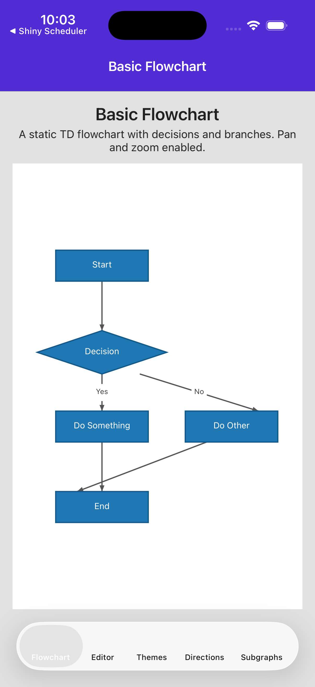 | 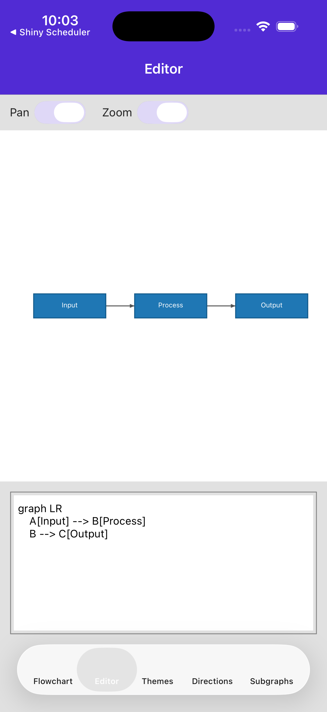 | 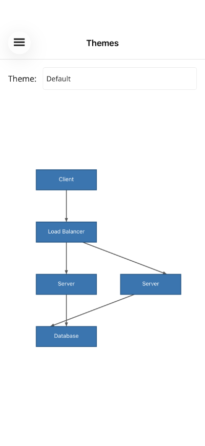 | 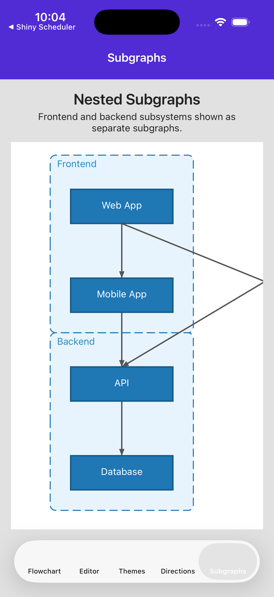 |

```bash
dotnet add package Shiny.Maui.Controls.MermaidDiagrams
```

```xml
xmlns:diagram="http://shiny.net/maui/diagrams"
```

```xml
<diagram:MermaidDiagramControl
    DiagramText="graph TD&#10;    A[Start] --> B{Decision}&#10;    B -->|Yes| C[Do Something]&#10;    B -->|No| D[Do Other]&#10;    C --> E[End]&#10;    D --> E"
    HorizontalOptions="Fill"
    VerticalOptions="Fill" />
```

**Features:**
- Mermaid `graph` / `flowchart` syntax (TD, LR, BT, RL directions)
- 6 node shapes: Rectangle, RoundedRectangle, Stadium, Circle, Diamond, Hexagon
- 6 edge styles: Solid, Open, Dotted, DottedOpen, Thick, ThickOpen
- Subgraph support with nested grouping
- 4 built-in themes: Default, Dark, Forest, Neutral
- Pan and pinch-to-zoom gestures
- Sugiyama layered graph layout algorithm
